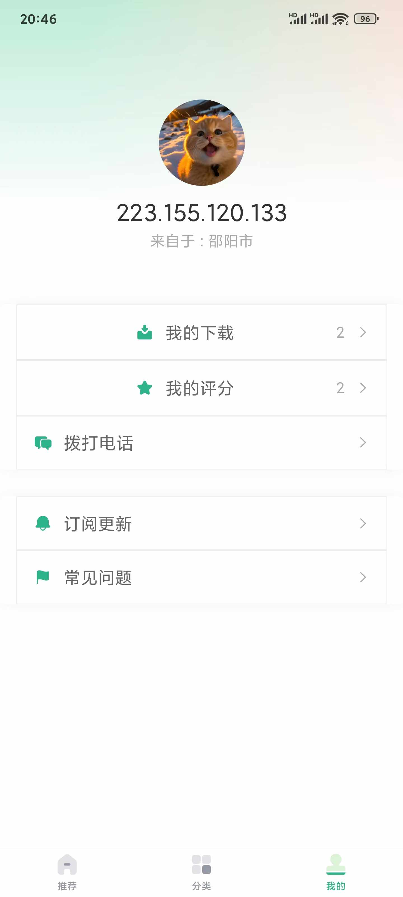

# Violet-wallpaper
搁浅壁纸


一款壁纸工具类软件 后端API由咸虾米壁纸提供

后端api地址 https://api.qingnian8.com/apis/

b站教学视频 https://www.bilibili.com/video/BV1Yg4y127Fp

# 开始

```js
npm install -g pnpm
pnpm run install
pnpm run dev:h5 // h5端
pnpm run dev:app // app端
pnpm run dev:mp-weixin // 微信小程序

pnpm run build:h5
pnpm run build:mp-weixin
pnpm run build:app
```


# app部分页面截图


